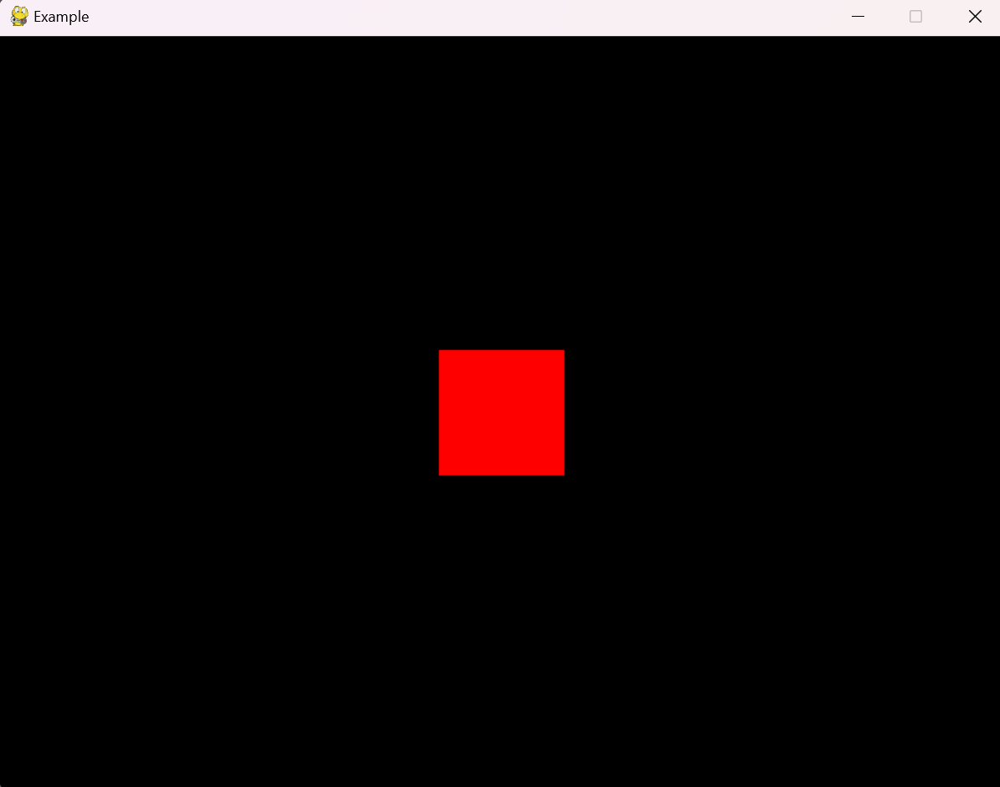

# Pygame Tools

Pygame Tools Tafh is an advanced game engine built upon pygame. Includes such things like tweens, game objects, scenes, etc.

---

## Example

```py
# main.py
import asyncio
from pygame_tools_tafh import *
from pygame_tools_tafh.vmath import *
    
class GameScene(Scene):

    def load(self, data):
        obj = GameObject("obj")
        obj.add_component(RectShapeComponent((255, 0, 0), Vector2d(100, 100)))

        obj2 = GameObject("obj2")
        obj2.add_component(SpriteComponent("image.png", (100, 200)))
        obj2.transform.position = Vector2d(100, 100)


engine = Engine("Example", 60, (800, 600))

def main():
    engine.register(GameScene("example"))
    asyncio.run(engine.load_scene("example", None))

if __name__ == "__main__":
    main()
```

## Run it

```bash
python3 main.py
```

